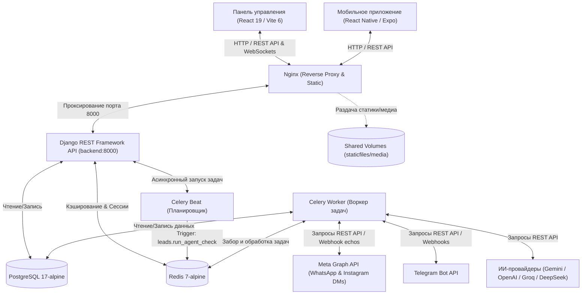

# Технический аудит проекта CAYU CRM

* **Дата аудита:** 10 июня 2026 года  
* **Версия документа:** 1.0.0  
* **Автор:** Antigravity AI  

---

## 1. Обзор архитектуры

### Схема компонентов (как она есть сейчас)

### Поток данных: входящее сообщение → вебхук → Celery → LLM → ответ

1. **Входящее сообщение (Inbound Message):**  
   Гость отправляет сообщение в мессенджер (например, Telegram или Instagram).
2. **Маршрутизация Webhook (HTTP POST):**  
   Запрос поступает на сервер, Nginx перенаправляет его на инстанс Django к эндпоинтам вебхуков:
   * Для Telegram: `instagram_views.py` (через webhook эндпоинты) или `telegram_views.py` / `whatsapp_views.py`.
   * Контроллер в Django (например, [instagram_webhook](file:///c:/Users/user/Desktop/axon_prod-1/backend/apps/leads/instagram_views.py#L564)) проверяет авторизацию (Verify Token) и обрабатывает событие.
3. **Запись активности и дедупликация:**  
   Система ищет или создает объект `Lead` на основе идентификатора мессенджера (например, `instagram_user_id`). В БД создается запись `LeadActivity` с типом сообщения (`whatsapp_received`, `telegram_received` или `instagram_received`).
4. **Асинхронная задача Celery:**  
   Чтобы не блокировать ответ платформе Meta/Telegram и избежать таймаутов, представление вызывает Celery-таску (например, [_delayed_instagram_ai_response.delay(...)](file:///c:/Users/user/Desktop/axon_prod-1/backend/apps/leads/instagram_views.py#L166)) с задержкой, равной `response_delay` из `AIConfig` (или в фоновом потоке/очереди).
5. **Классификация намерения (Intent classification):**  
   Воркер Celery берет задачу и отправляет быстрый запрос к LLM (в [classify_intent](file:///c:/Users/user/Desktop/axon_prod-1/backend/apps/leads/agent_dispatcher.py#L264)) для определения намерения (booking, greeting, faq, undecided, off_topic).
6. **Вызов Мультиагентного Пайплайна:**  
   [AgentDispatcher](file:///c:/Users/user/Desktop/axon_prod-1/backend/apps/leads/agent_dispatcher.py) передает выполнение нужному агенту.
7. **Генерация ответа (LLM Response):**  
   Выбранный агент делает запрос к провайдеру ИИ (через [ai_service](file:///c:/Users/user/Desktop/axon_prod-1/backend/apps/leads/ai_service.py)). ИИ формирует ответ с использованием контекста диалога и Playbooks (базы знаний отеля).
8. **Отправка ответа клиенту:**  
   Django отправляет HTTP-запрос к API мессенджера для отсылки сообщения. В БД сохраняется запись `LeadActivity` с типом отправки (`whatsapp_sent` и т.д.) с флагом `echo_origin='crm'`.

### Описание мультиагентного пайплайна (Router → Booking / Consultant / CS)

Архитектура построена на базе паттерна диспетчеризации намерений (Intent Routing):
* **Router Agent (`classify_intent`)**: Классифицирует последнее сообщение гостя. Важное преимущество: учитывает текущую стадию диалога (`booking_step` из контекста лида), чтобы избежать ложных срабатываний и случайного переключения темы в процессе сбора контактных данных.
* **Booking Agent (`booking`) / Greeting**: Занимается сбором параметров бронирования (даты заезда/выезда, число гостей, питание). Вызывает встроенные инструменты поиска свободных номеров.
* **Consultant Agent (`consultant`)**: Помогает «неопределившимся» гостям выбрать категорию номера (стандарт, полулюкс, семейный) путем квалификационных вопросов.
* **Customer Service Agent (`cs`) / FAQ**: Отвечает на не связанные с прямым бронированием вопросы об услугах (Wi-Fi, бассейн, правила проживания с животными), обращаясь к плейбукам.

---

## 2. Аудит backend/

### Структура Django-приложений (apps/)
* **`organizations`**: Отвечает за мультиарендность (Multi-tenancy). Содержит модели `Organization` и `OrganizationMember`. Предоставляет `OrganizationQuerysetMixin` для автоматической изоляции данных на уровне БД.
* **`users`**: Кастомная модель пользователя `User` с разделением ролей (Owner, Admin, Support) и привязкой к текущей организации (`current_organization`).
* **`leads`**: Ядро системы. Содержит сущности лидов, историю коммуникаций (`LeadActivity`), задачи (`Task`), цели (`LeadGoal`), конфигурации вебхуков каналов (Telegram, WhatsApp, Instagram, RingCentral) и логику ИИ-агентов.
* **`audit`**: Логирование изменений, связанных с действиями пользователей и воркеров (на базе `django-auditlog`).
* **`hotel_media`**: Управление файлами отеля (фотографиями, видео, документами), используемыми ИИ-ассистентом для отправки гостям.
* **`hotel_info`**: Хранилище профиля отеля, его FAQ, политик, сетки цен (`RoomPricing`) и плейбуков (Playbooks), формирующих базу знаний для LLM.
* **`flows`**: Настройка сценариев автоматизации, шагов промптов и конфигурация моделей.

### Модели: связи и потенциальные проблемы
* **Multi-tenant изоляция**: Связь с организацией осуществляется через внешний ключ `organization` (использует словарь `ORG_FK`). У некоторых вспомогательных таблиц (например, `LeadNote`, `LeadActivity`) связь идет через `Lead`, что повышает риск утечки при неправильном джоине, если не проверять родительский лид.
* **Отсутствие индексов**: В [Lead](file:///c:/Users/user/Desktop/axon_prod-1/backend/apps/leads/models.py#L63) индексы установлены на `telegram_chat_id`, `instagram_user_id` и `whatsapp_phone`. Однако поля `email` и `phone` часто используются для поиска, но не индексированы.
* **N+1 проблема**: При выборке `LeadActivity` в мессенджерах не всегда используется `select_related('lead')` и `prefetch_related('lead__organization')`, что приводит к каскаду точечных запросов к БД при генерации истории переписки.

### Views / Serializers
* **Избыточность и DRY**: Вьюсеты во многом дублируют логику фильтрации по организации. Хотя используется `OrganizationQuerysetMixin`, в некоторых экшенах (например, `stats`, `source_stats` в `LeadViewSet`) логика фильтрации прописана вручную: `org = None if user.is_superadmin else self._get_organization()`.
* **Жирные контроллеры**: Файлы вебхуков (например, `instagram_views.py` — 774 строки) содержат в себе бизнес-логику парсинга, валидации, сборки истории переписки, отправки сообщений и логику ветвления ИИ. Этот код должен быть вынесен в сервисный слой.

### Celery tasks
* **Текущие задачи**: Существует периодическая задача `leads.run_agent_check` (каждые 30 минут) для запуска проверок автономного фоллоу-апа. Также есть `_delayed_instagram_ai_response` для обработки ответов.
* **Отсутствие retry-логики**: Задачи связи с Meta API и LLM-провайдерами подвержены сетевым сбоям, но декоратор `@shared_task` не содержит настроек `autoretry_for=(RequestException, APIError,)`, `retry_backoff=True` и `max_retries`. В случае сбоя сети задача просто теряется.

### settings.py
* **Безопасность**: Файл настроек использует `django-environ` для подгрузки секретов. Имеется переменная `ENABLE_PRODUCTION_SECURITY`, регулирующая HSTS и `SECURE_SSL_REDIRECT`. Однако `LOGGING` жестко пишет логи в файл в локальной папке проекта (`LOGS_DIR`), что усложняет сбор логов в Docker/ECS Fargate (логи должны писаться в stdout/stderr).

### requirements.txt
* ** requirements.txt**: Зависимости зафиксированы в виде `>=версия`. Это может привести к поломке сборки в будущем при выпуске несовместимых минорных или мажорных обновлений библиотек (особенно для быстро меняющихся библиотек типа `langgraph` и `google-genai`). Требуется жесткая фиксация (заморозка `==`).

---

## 3. Аудит web/ и mobile/

### Структура компонентов React (web/src)
* **Роутинг**: Используется `@tanstack/react-router`, генерирующий строго типизированное дерево путей в `routeTree.gen.ts`. Это современный и надежный подход.
* **Организация**: Файлы сгруппированы по техническому назначению (`components`, `contexts`, `hooks`, `routes`). Компоненты UI лежат в `components/ui` (выгруженные через shadcn).
* **God-components**: Страница коммуникаций (чат) и страница настроек интеграций содержат в себе слишком много логики отображения, парсинга сообщений и управления формами. Требуется декомпозиция на мелкие чистые компоненты.

### Управление состоянием
* **Локальный контекст**: Для авторизации и языка используются стандартные контексты React React (`auth-context.tsx`, `language-context.tsx`).
* **Асинхронное состояние**: Для взаимодействия с API используется `@tanstack/react-query` (React Query). Это исключает необходимость в тяжелых стейт-менеджерах вроде Redux, так как почти все состояние приложения является серверным.

### API-слой и типизация
* **Интеграция**: Все запросы проходят через централизованный обертку `apiFetch` в [lib/api.ts](file:///c:/Users/user/Desktop/axon_prod-1/web/src/lib/api.ts). Обертка автоматически обрабатывает обновление токена JWT (через refresh-токен с ротацией).
* **Типизация**: API-ответы и тела запросов типизированы с помощью интерфейсов TypeScript (`Lead`, `Customer`, `HotelMediaItem` и др.).

### TypeScript
* **Качество типов**: В `tsconfig.json` включен режим `"strict": true`.
* **Использование `any`**: В кодовой базе практически отсутствуют явные объявления `any`, за исключением редких мест интеграции с нестандартными форматами ответов API. Качество типизации оценивается как высокое.

---

## 4. Аудит инфраструктуры

### docker-compose.yml
* **Конфигурация контейнеров**:
  * БД (`db`): Используется Postgres 17. Версия современная, данные монтируются в именованный том `postgres_data`.
  * Брокер (`redis`): Redis 7.
  * Backend, Celery Worker и Celery Beat собираются из одной директории `./backend`.
* **Проблемы**:
  * Контейнеры Celery Worker и Beat не имеют лимитов по памяти и CPU, что может приводить к OOM-kill при тяжелых нагрузках LLM/LangGraph.
  * Фронтенд собирается на этапе Docker-сборки и раздается через Nginx. Но Nginx также проксирует API на бэкенд, что удобно для локального запуска.

### nginx.conf
* Конфигурация включает Gzip-сжатие и проксирует `/api` и `/admin` на контейнер `backend:8000`.
* **Безопасность**: Отсутствуют заголовки безопасности, такие как `Content-Security-Policy` (CSP), `X-Content-Type-Options: nosniff`, `Referrer-Policy`, а также заголовок `Strict-Transport-Security` (HSTS).

### GitHub Actions
* Текущий воркфлоу [deploy.yml](file:///c:/Users/user/Desktop/axon_prod-1/.github/workflows/deploy.yml) выполняет деплой напрямую через SSH-подключение к серверу, стягивая код из репозитория и запуская сборку образов прямо на боевой машине.
* **Недостатки**: Нет этапов статического анализа (flake8/eslint), запуска тестов (pytest), сборки образов на серверах GitHub (нет Docker Registry) и кэширования слоев. Сборка на прод-сервере перегружает CPU во время деплоя.

### Статус папок scratch/ и password_backups/
* **`password_backups/`**: Содержит файл [backups_kstu.json](file:///c:/Users/user/Desktop/axon_prod-1/password_backups/backups_kstu.json) с реальными именами пользователей и хэшами паролей. Хранение таких бэкапов в публичном или даже приватном git-репозитории несет огромные комплаенс- и ИБ-риски.
* **`scratch/`**: Содержит множество тестовых скриптов и текстовых файлов с дампами БД (`db_dump_info.txt`, `inspect_details_output.txt`). Риск случайного коммита реальных персональных данных или токенов в историю Git.

---

## 5. Технический долг

### Таблица технического долга

| Компонент | Описание проблемы | Критичность | Трудозатраты |
| :--- | :--- | :--- | :--- |
| **ИБ / Git** | Папка `password_backups/` и логи отладки в `scratch/` находятся в репозитории | **High** | S |
| **Backend / API** | Логика вебхуков перегружена задачами обработки ИИ (fat views) | **Medium** | M |
| **Backend / Celery** | Отсутствует обработка сетевых ошибок (retry) в тасках запросов к LLM и Meta API | **High** | S |
| **DevOps / CI/CD** | Сборка Docker-образов на прод-сервере во время деплоя ( downtime/CPU spike ) | **Medium** | M |
| **Backend / DB** | Отсутствуют индексы на полях частого поиска лидов (`email`, `phone`) | **Medium** | S |
| **Nginx** | Отсутствие заголовков безопасности в конфигурации сервера | **Medium** | S |
| **Requirements** | Не зафиксированы точные версии зависимостей в `requirements.txt` (используется `>=`) | **High** | S |

### Приоритизация исправлений

1. **Первоочередно (Безопасность):** Удаление папки `password_backups/` и очистка Git-истории от секретов. Добавление `autoretry_for` в Celery-задачи для предотвращения падений при сбоях API мессенджеров и LLM.
2. **Второочередно (Стабильность сборки):** Заморозка точных версий зависимостей в `requirements.txt`. Добавление индексов на `email` и `phone` в модели `Lead`.
3. **Третьеочередно (Оптимизация):** Вынос логики вебхуков в сервисный слой, настройка кэширования для повторяющихся запросов.
