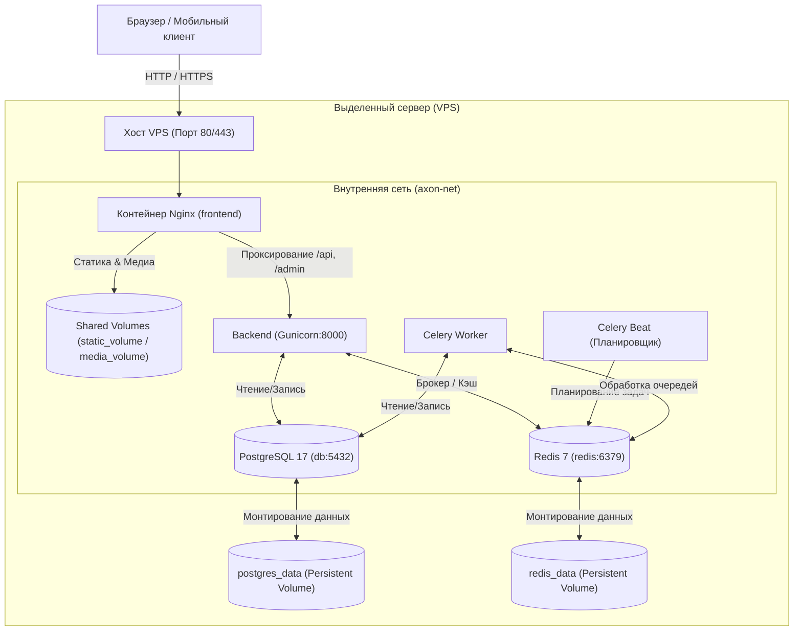
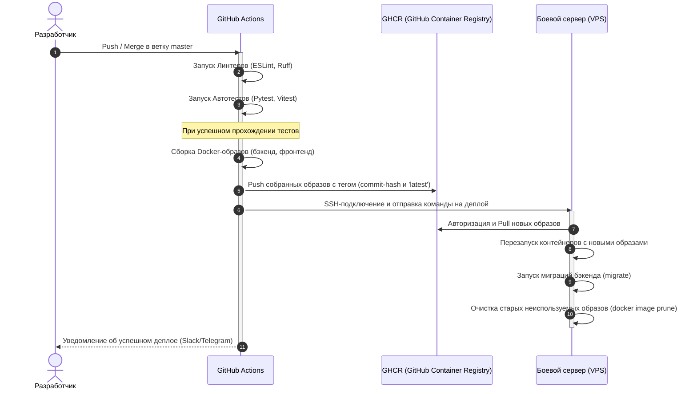
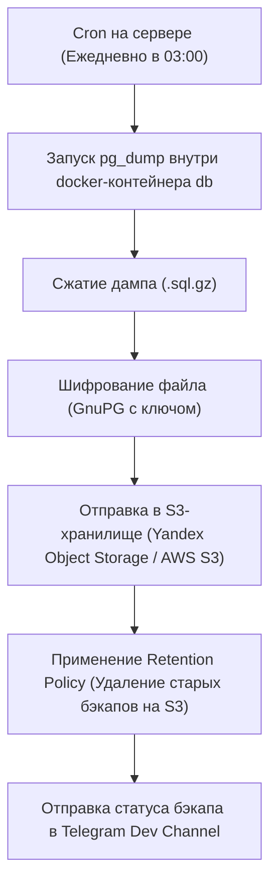

# Руководство по деплою и инфраструктурным решениям CAYU CRM

* **Дата аудита:** 10 июня 2026 года  
* **Версия документа:** 1.0.0  
* **Автор:** Antigravity AI  

---

## 1. Текущее состояние инфраструктуры

На текущем этапе проект развернут на одном выделенном сервере (VPS/Bare Metal) с использованием Docker Compose для контейнеризации и оркестрации всех необходимых сервисов. Подключен домен, настроен базовый контур CI/CD через GitHub Actions.

### Схема текущей инфраструктуры

### Архитектура развертывания (CI/CD)
Процесс деплоя в данный момент реализован по упрощенной схеме в файле [.github/workflows/deploy.yml](file:///c:/Users/user/Desktop/axon_prod-1/.github/workflows/deploy.yml):
1. Разработчик делает push в ветку `master`.
2. Раннер GitHub Actions запускает шаг `appleboy/ssh-action@v1.2.0` для подключения к продакшн-серверу через SSH.
3. На сервере выполняется последовательность bash-команд:
   * Переход в папку проекта `/home/Axon_prod/Axon_prod/axon_prod`.
   * Жесткий сброс локальных изменений до `origin/master` (`git reset --hard`).
   * Полная остановка контейнеров (`docker compose down`).
   * Пересборка образов и запуск в фоновом режиме (`docker compose up -d --build`).

**Ключевой недостаток текущей схемы:** Сборка Docker-образов происходит непосредственно на продакшн-сервере. В процессе сборки фронтенда (React сборка через Node.js) и сборки бэкенда (установка pip-пакетов) резко возрастает нагрузка на CPU и RAM, что приводит к зависанию сервера, задержкам ответов на входящие вебхуки и временной недоступности (downtime) CRM для клиентов.

---

## 2. Kubernetes: честная оценка целесообразности

Переход на Kubernetes (K8s) — это популярный шаг для масштабирования, однако для текущей фазы проекта CAYU CRM он **не рекомендуется**.

### Честная оценка по масштабу нагрузки

| Метрика | Текущий уровень (Docker Compose) | Порог для перехода на Kubernetes |
| :--- | :--- | :--- |
| **Количество отелей (тенантов)** | 1 – 20 | 100+ активных организаций |
| **Нагрузка (RPS)** | < 10 RPS | > 100 RPS стабильной нагрузки |
| **Количество сообщений мессенджеров**| < 50 000 сообщений в сутки | > 500 000 сообщений в сутки |
| **Инженерные ресурсы** | 0.5 – 1 разработчик на DevOps | Минимум 1 выделенный DevSecOps-инженер |

### Что дал бы Kubernetes проекту в будущем?
* **Auto-scaling Celery воркеров (HPA):** При резком росте количества входящих сообщений (например, рассылки отелей в праздничные дни) K8s может автоматически разворачивать дополнительные поды с Celery-воркерами на базе метрик длины очереди в Redis (через KEDA).
* **Rolling Updates без даунтайма:** Обновление API-сервисов без единой секунды прерывания обслуживания клиентов (поочередная замена контейнеров).
* **Self-healing (Самовосстановление):** Автоматический перезапуск упавших или зависших воркеров/контейнеров API.

### Почему K8s не нужен сейчас (Минусы)
1. **Высокая стоимость инфраструктуры:** Минимальный отказоустойчивый кластер (3 ноды master + worker) обойдется значительно дороже текущего монолитного VPS.
2. **Сложность обслуживания:** Администрирование кластера, сетей (Ingress, Calico/Flannel), логов, Secrets и сертификатов требует высокой DevOps-квалификации. На это будет тратиться время, необходимое для развития продукта.
3. **Хранение состояния (Stateful):** Работа с СУБД PostgreSQL внутри Kubernetes (даже через операторы вроде CloudNativePG) значительно сложнее, чем на выделенном диске в Docker.

### Альтернативный путь на ближайшие 6-12 месяцев
Оптимальным решением является масштабирование без Kubernetes:
1. **Docker Swarm:** Если потребуется запустить проект на 2-3 серверах. Он нативно поддерживает Docker Compose файлы, настраивается за 15 минут и дает базовый Rolling Update и отказоустойчивость без оверхеда Kubernetes.
2. **Ansible + Простой балансировщик (Haproxy/Nginx):** Шаблонизация конфигураций серверов для быстрого развертывания реплик бэкенда.
3. **Разделение ресурсов:** Перенос PostgreSQL на управляемую БД (Managed Database в облаке Yandex Cloud / AWS / Selectel) и Redis на Managed Cache. Это высвободит до 40% ресурсов основного VPS.

**Вывод:** На ближайшие 6–12 месяцев оставаться на Docker Compose (или Docker Swarm), но вынести базу данных PostgreSQL на отдельный управляемый облачный инстанс.

---

## 3. Сравнение платформ CI/CD: GitHub Actions vs GitLab CI

В репозитории уже используется GitHub Actions. Оценим необходимость миграции на self-hosted/cloud GitLab CI.

| Критерий | GitHub Actions (Текущий) | GitLab CI (Альтернатива) |
| :--- | :--- | :--- |
| **Стоимость** | Бесплатно для публичных репозиториев. 2000 бесплатных минут/мес для приватных. | Требует оплаты за пользователя или развертывания своего GitLab инстанса. |
| **Инфраструктура раннеров** | Предоставляется GitHub (Ubuntu/Win/macOS). Можно подключать свои раннеры. | Требуется хостинг для GitLab Runner (или использование ограниченных минут в SaaS). |
| **Интеграция с Git** | Бесшовная (все в рамках одной платформы GitHub). | Требует зеркалирования репозитория или полного переноса исходного кода на GitLab. |
| **Реестр образов (Registry)** | Нативный GitHub Packages (GHCR) — простой и бесплатный в рамках лимитов. | Отличный встроенный GitLab Container Registry. |
| **Безопасность секретов** | GitHub Encrypted Secrets (простые переменные). | Поддержка маскирования, защищенных переменных и интеграции с HashiCorp Vault. |

**Вывод:** Переезд на GitLab CI **нецелесообразен**. Текущего функционала GitHub Actions полностью достаточно. Переезд создаст ненужную инфраструктурную нагрузку на команду. Вместо миграции следует оптимизировать существующий пайплайн GitHub Actions.

---

## 4. План модернизации CI/CD-пайплайна

Текущий деплой через прямую сборку на хосте необходимо заменить на сборку образов на стороне GitHub с последующим пушем в Docker Registry.

### Схема оптимизированного CI/CD процесса

### Как реализовать Rolling Update на одном сервере
Чтобы исключить мигание интерфейса и недоступность API во время перезапуска контейнеров бэкенда на одном сервере, следует применить следующую стратегию:
1. Запустить **два** инстанса бэкенда (`backend_blue` и `backend_green`) за одним Nginx-контейнером.
2. В процессе деплоя скрипт сначала обновляет и перезапускает первый контейнер, проверяет его работоспособность (healthcheck), переключает на него трафик в Nginx (`nginx -s reload`), а затем обновляет второй контейнер.
3. Для фронтенда использовать концепцию атомарного деплоя: сборка статики упаковывается в архив, копируется в общую директорию с уникальным хэшем версии, а символическая ссылка (`symlink`) в Nginx переключается мгновенно на новую папку.

---

## 5. Мониторинг и оповещения на продакшене

Для обеспечения отказоустойчивости необходимо внедрить трехуровневую систему мониторинга.

### Минимальный рабочий стек (Начать сейчас)
1. **Sentry (Отслеживание ошибок бэкенда и фронтенда):**
   * Интегрировать Sentry SDK в Django [config/settings.py](file:///c:/Users/user/Desktop/axon_prod-1/backend/config/settings.py). Ловит все необработанные исключения (500-е ошибки), ошибки связи с базой данных и LLM-провайдерами.
   * Интегрировать Sentry в React-приложение для фиксации JS-ошибок на стороне клиента.
2. **UptimeRobot / Better Uptime (Внешний пингер):**
   * Бесплатный мониторинг доступности домена. Раз в 60 секунд отправляет HEAD-запрос на `/api/health/` (требуется создать этот простой эндпоинт, который проверяет подключение к БД и Redis). При падении шлет PUSH-уведомление или SMS.
3. **Celery Flower (Мониторинг очередей задач):**
   * Добавить сервис `flower` в [docker-compose.yml](file:///c:/Users/user/Desktop/axon_prod-1/docker-compose.yml) на базе образа `mher/flower`.
   * Защитить панель Basic Auth-авторизацией через Nginx. Позволяет в реальном времени видеть зависшие задачи ИИ, количество воркеров и перезапускать упавшие задачи.

### Целевой стек (Через 3-6 месяцев / При росте нагрузки)
Внедрить связку **Prometheus + Grafana + Node Exporter**:
* **Что собирать:**
   * Нагрузку на хост (CPU, RAM, заполнение диска — Node Exporter).
   * Метрики PostgreSQL (размер таблиц, количество активных коннектов, кэш-хиты — postgres_exporter).
   * Метрики очередей (длина очередей задач Celery).
   * Метрики приложения (время ответа API, latency запросов к OpenAI/Gemini, количество ошибок авторизации).
* **Каналы оповещений:** Настроить Grafana Alerting для отправки критических алертов в закрытый Telegram-чат технической поддержки разработчиков.

---

## 6. Стратегия резервного копирования

Утеря базы данных отелей с переписками клиентов — критический риск для бизнеса. Схема бэкапов должна быть полностью автоматизирована и исключать хранение на том же сервере.

### Схема резервного копирования PostgreSQL

### Регламент резервного копирования

1. **Периодичность:**
   * **База данных PostgreSQL:** Полный бэкап каждую ночь (в 03:00 по местному времени отеля, когда нагрузка минимальна).
   * **Медиафайлы (фото отелей, документы):** Инкрементальный бэкап (синхронизация измененных файлов) раз в сутки на S3 через утилиту `rclone` / `aws s3 sync`.
2. **Retention Policy (Срок хранения копий):**
   * Хранить ежедневные бэкапы за последние **14 дней**.
   * Хранить еженедельные бэкапы за последние **4 недели**.
   * Хранить ежемесячные бэкапы за последние **6 месяцев**.
   * Все бэкапы старше этого срока автоматически удаляются правилами жизненного цикла S3-бакета (Lifecycle Rules).
3. **Тестирование восстановления (Важно!):**
   * Раз в квартал проводить тестовое развертывание бэкапа на staging/dev окружении для проверки целостности данных. Бэкап, восстановление которого не проверялось, считается несуществующим.
