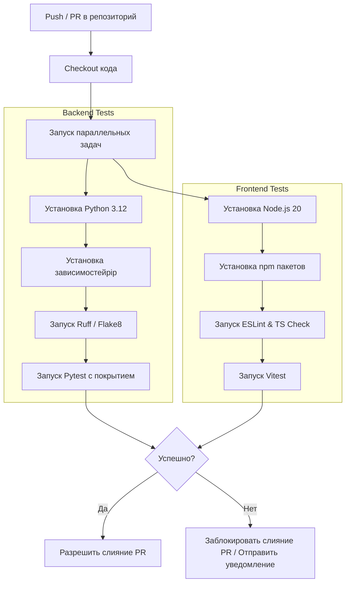

# Карта тестирования проекта CAYU CRM

* **Дата аудита:** 10 июня 2026 года  
* **Версия документа:** 1.0.0  
* **Автор:** Antigravity AI  

---

## 1. Текущее состояние

На данный момент в проекте настроено только тестирование бэкенда на базе встроенного тестового запускателя Django (`django.test.TestCase`). Фронтенд (web) и мобильное приложение (mobile) на данный момент не имеют автоматических тестов.

### Существующий тестовый стек бэкенда
Тесты распределены по Django-приложениям в папке [apps](file:///c:/Users/user/Desktop/axon_prod-1/backend/apps):
* **`leads`**: Файл [leads/tests.py](file:///c:/Users/user/Desktop/axon_prod-1/backend/apps/leads/tests.py) представляет собой объемный набор интеграционных и юнит-тестов (3240 строк, 146 КБ). Он покрывает ключевую бизнес-логику ИИ-ассистента:
  * `BlankAutoReplyRetryTests` — логика обработки пустых генераций от LLM и повторные попытки с записью отладочных шагов в БД.
  * `GlobalChannelAiPauseTests` — ручная и автоматическая приостановка ИИ-ассистента менеджером.
  * `ResetAiMemoryTests` — сброс контекста диалога и истории сообщений для ИИ.
  * `InstagramOAuthFlowTests` — процесс авторизации OAuth для интеграции с Instagram API.
  * `PreciseScheduledFollowupTests` — планирование и запуск отложенных напоминаний (фоллоу-апов) клиентам.
* **`flows`**: Файл [flows/tests.py](file:///c:/Users/user/Desktop/axon_prod-1/backend/apps/flows/tests.py) проверяет работу конечного автомата сценариев (Flow Builder):
  * `FlowCardPolicyTests` — экспорт политик диалоговых карт в API и генератор промптов LLM.
  * Тестирование логики сборщика параметров `sync_stage_state` и нормализации аргументов для вызова инструментов `normalize_booking_tool_args`.
  * Валидация распознавания пользовательских фраз с датами и количеством гостей (например, *"Нас будет 5 человек, планируем 5го числа этого месяца"*).
* **`organizations`**: Файл [organizations/tests.py](file:///c:/Users/user/Desktop/axon_prod-1/backend/apps/organizations/tests.py) тестирует права доступа пользователей к настройкам отеля на основе ролей:
  * `OrganizationSettingsVisibilityTests` — проверка ограничений для OWNER, ADMIN и MEMBER (роль support) при попытке изменения видимости внутренних утилит.
* **`users`**: Файл [users/tests.py](file:///c:/Users/user/Desktop/axon_prod-1/backend/apps/users/tests.py) тестирует безопасность отладочных API:
  * `DevDatabaseExportTests` — проверка прав на выгрузку слепков БД разработчиками (разрешено только Owner/Admin, заблокировано для линейных менеджеров).

### Оценка покрытия и пробелы
* **Бэкенд:** Логика парсинга дат, теневой обработки пустых ответов LLM и переключения шагов сценария покрыта хорошо. Однако полностью отсутствуют тесты в приложениях `hotel_info`, `hotel_media` и `audit`. Интеграционные тесты эндпоинтов DRF написаны выборочно, в основном для нестандартных действий (типа экспорта БД).
* **Фронтенд и мобильное приложение:** Тестирование отсутствует. В [web/package.json](file:///c:/Users/user/Desktop/axon_prod-1/web/package.json) и [mobile/package.json](file:///c:/Users/user/Desktop/axon_prod-1/mobile/package.json) нет зависимостей для тестирования (кроме React Test Renderer для Expo) и соответствующих npm-скриптов.

---

## 2. Что необходимо протестировать

Для достижения высокого уровня стабильности и предотвращения регрессий необходимо расширить тестовое покрытие по следующим направлениям:

### 2.1 Backend Unit-тесты
* **Бизнес-модели и валидаторы:**
  * Валидация форматов номеров телефонов (`whatsapp_phone`, `phone`) в [leads/models.py](file:///c:/Users/user/Desktop/axon_prod-1/backend/apps/leads/models.py).
  * Корректность расчета динамических цен в зависимости от сезона и дня недели в `RoomPricing` ([hotel_info/models.py]).
* **Вспомогательные утилиты:**
  * Парсеры входящих медиафайлов и конвертеры форматов.
* **Диспетчер агентов (`AgentDispatcher`):**
  * Изолированное тестирование метода `classify_intent` в [agent_dispatcher.py](file:///c:/Users/user/Desktop/axon_prod-1/backend/apps/leads/agent_dispatcher.py) с различными наборами пользовательских сообщений.

### 2.2 Backend Интеграционные тесты
* **API Эндпоинты (DRF APITestCase):**
  * Полноценный CRUD-цикл для разделов настроек отеля, FAQs, Playbooks, загрузки медиа-файлов.
  * Права доступа (RBAC): проверка, что методы `POST / PUT / DELETE` на критических ресурсах возвращают `403 Forbidden` для пользователей с ролью `support`.
* **Задачи Celery:**
  * Корректность обработки задач рассылки фоллоу-апов.
  * Поведение Celery-воркеров при временной недоступности Redis или PostgreSQL (проверка транзакционности и отсутствия дублирования сообщений).

### 2.3 Тестирование ИИ-пайплайна
* **Маршрутизация Router Agent:**
  * Проверка перехода между агентами (Booking / FAQ / Consultant) при изменении контекста диалога.
  * Удержание контекста: тест на то, что если лид находится посреди процесса сбора дат бронирования (`booking_step`), случайный вопрос (например, *"у вас есть Wi-Fi?"*) не сбросит текущую сессию сбора данных.
* **Booking Agent:**
  * Точность разбора параметров бронирования (даты заезда, выезда, количество гостей, тип питания, наличие детей) при сложных текстовых формулировках.
* **Интеграция с LLM (Mocking):**
  * Покрытие интеграционного пайплайна моками ответов LLM (через `unittest.mock`), чтобы исключить реальные вызовы API Gemini/OpenAI при прогоне тестов в CI. Это ускорит тесты и сэкономит бюджет.

### 2.4 Тестирование Вебхуков
* **Telegram, WhatsApp, Instagram:**
  * Симуляция входящих HTTP POST запросов (JSON payloads) от серверов мессенджеров на эндпоинты Django.
  * Проверка дедупликации сообщений (что повторный вебхук с тем же `message_id` / `wamid` не запускает генерацию ИИ-ответа дважды).
  * Проверка верификации подписи Meta и секретного токена Telegram.

### 2.5 Multi-tenant Изоляция (Критично)
* **Защита от утечек данных между отелями (Cross-Tenant):**
  * Создание тестовой базы с двумя организациями: Отель А и Отель Б.
  * Проверка, что GET-запросы с JWT-токеном пользователя Отеля А к `/api/leads/`, `/api/flows/`, `/api/faq/` никогда не возвращают записи, принадлежащие Отелю Б.
  * Проверка, что POST-запрос от Отеля А на создание ресурса с явным указанием `organization_id` Отеля Б либо завершается ошибкой, либо принудительно переписывает ID на организацию отправителя.

### 2.6 Frontend и Mobile тесты
* **Компонентные тесты (Vitest + Testing Library):**
  * Рендеринг и логика фильтрации чатов в [communications.tsx](file:///c:/Users/user/Desktop/axon_prod-1/web/src/routes/_app/communications.tsx).
  * Корректность отображения и валидация форм в конструкторе сценариев [flows.tsx](file:///c:/Users/user/Desktop/axon_prod-1/web/src/routes/_app/flows.tsx).
  * Отображение диагностических шагов ИИ в интерфейсе чата.
* **E2E тесты (Playwright):**
  * Сценарий входа (Login) и авторизации.
  * Создание и редактирование карт сценариев во Flow Builder с последующим сохранением.
  * Отправка ручного сообщения в активный чат менеджером и проверка изменения статуса диалога.

---

## 3. Матрица приоритетов тестирования

| Модуль | Тип теста | Описание | Приоритет | Сложность |
| :--- | :--- | :--- | :--- | :--- |
| **Multi-Tenancy** | Интеграционный (API) | Изоляция данных отелей А и Б | **Критический** | Medium |
| **Leads / Webhooks** | Интеграционный | Обработка вебхуков Telegram/WA, дедупликация | **Высокий** | High |
| **Flows / State Machine** | Юнит / Интеграционный | Переходы по шагам сценария во Flow Builder | **Высокий** | Medium |
| **Auth / RBAC** | Интеграционный | Разграничение прав доступа Owner / Admin / Support | **Высокий** | Low |
| **Booking / Pricing** | Юнит | Расчет стоимости проживания по правилам отеля | **Средний** | Medium |
| **UI Communications** | Компонентный (React) | Отображение чата, ручная отправка сообщений | **Средний** | High |
| **E2E Playwright** | E2E | Сквозной сценарий: Вход -> Создание Flow -> Чат | **Низкий** | High |
| **Mobile App** | Компонентный | Рендеринг карточек лидов и пуш-уведомлений | **Низкий** | Medium |

---

## 4. Рекомендуемый стек и интеграция в CI/CD

### 4.1 Стек инструментов

#### Backend (Python)
1. **`pytest-django`**: Альтернатива стандартному Django test runner. Позволяет использовать мощные фикстуры, параметризацию тестов и более лаконичный синтаксис.
2. **`factory_boy`**: Инструмент для декларативного создания тестовых данных (замена статическим JSON-фикстурам). Позволяет быстро генерировать связанные сущности (`LeadFactory`, `OrganizationFactory`, `LeadActivityFactory`).
3. **`responses`**: Библиотека для мокирования исходящих HTTP-запросов (вместо ручного патчинга `requests.post`). Идеально подходит для эмуляции ответов Telegram Bot API / Meta Graph API.
4. **`freezegun`**: Необходим для заморозки или сдвига системного времени. Позволяет тестировать задачи Celery по отправке фоллоу-апов через 24/48 часов.
5. **`pytest-cov`**: Генерация отчетов о покрытии кода тестами.

#### Frontend (Vite / React / TypeScript)
1. **`Vitest`**: Быстрый запуск тестов, использующий конфигурацию Vite.
2. **`React Testing Library`**: Тестирование компонентов в среде, максимально приближенной к браузеру (без рендеринга реального DOM).
3. **`msw` (Mock Service Worker)**: Перехват HTTP-запросов фронтенда на уровне сети. Позволяет отдавать мок-ответы API без запуска бэкенд-сервера.

#### E2E и Mobile
1. **`Playwright`**: Современный инструмент E2E тестирования, поддерживающий Chromium, Firefox и WebKit «из коробки».
2. **`Jest` + `React Native Testing Library`**: Для тестирования мобильного Expo-приложения.

---

### 4.2 Интеграция в GitHub Actions (CI)

Для автоматического запуска тестов при каждом Pull Request или push в ветку `master` необходимо настроить пайплайн CI. Ниже приведено описание шагов для реализации в `.github/workflows/ci.yml`:



#### Описание этапов CI-пайплайна бэкенда:
1. **Кэширование зависимостей:** Использование `actions/cache` для папки `~/.cache/pip`, что сокращает время сборки с 5 минут до 45 секунд.
2. **Сервисы (Services):** Запуск контейнера PostgreSQL и Redis прямо в окружении GitHub Actions runner для интеграционных тестов:
   ```yaml
   services:
     postgres:
       image: postgres:17-alpine
       env:
         POSTGRES_DB: axon_test
         POSTGRES_USER: postgres
         POSTGRES_PASSWORD: password
       ports:
         - 5432:5432
     redis:
       image: redis:7-alpine
       ports:
         - 6379:6379
   ```
3. **Миграции и запуск:** Выполнение `python backend/manage.py migrate` перед прогоном тестов.
4. **Запуск pytest:** Выполнение команды `pytest --cov=apps --cov-report=xml`.
5. **Анализ покрытия:** Интеграция с сервисами типа Codecov для автоматического вывода процента покрытия в Pull Request.

#### Описание этапов CI-пайплайна фронтенда:
1. **Кэширование `node_modules`:** Кэширование папки `web/node_modules` на основе хэша `web/package-lock.json`.
2. **Проверка типов (Type Check):** Запуск `npm run build` или `npx tsc --noEmit` для валидации TypeScript-типов.
3. **Запуск тестов:** Выполнение `npm run test:run` (Vitest в non-watch режиме).
